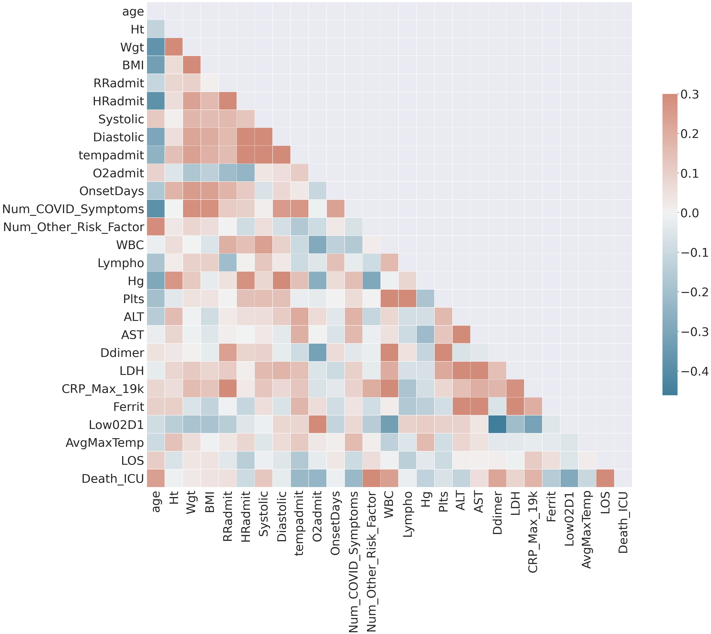
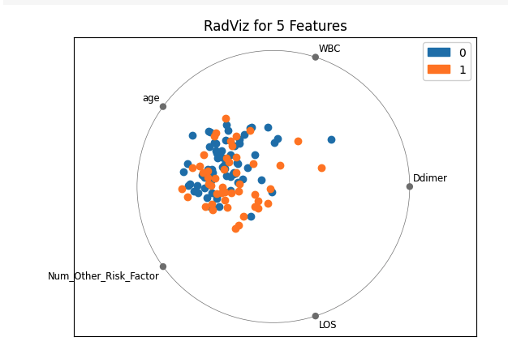
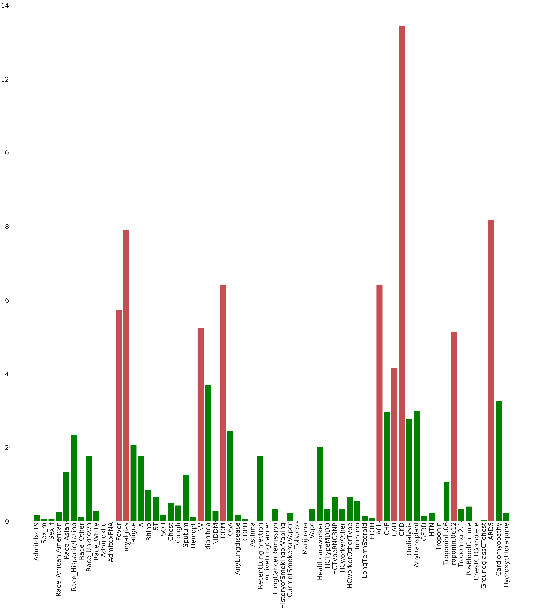

# **COVID-19 Case Severity Analysis**

    

## **Introduction**
We are going to be analyzing how different factors affect the severity of COVID-19 in an infected patient.
We will be looking primarily at pre-existing diseases, as this is theorized to increase the chance of
serious illness or even death from coronavirus. In addition, we will also take into account how
demographic factors like age, race, sex, and financial status affect the severity.
We know that having a pre-existing disease will increase the chance of medical problems related to coronavirus,
but we do not know how much each disease affects the severity. We hope this intersection of
pre-existing diseases and demographics with severity of illness in COVID-19 patients will lead to insightful information about the virus.    

## **Background**
Hospitals have been overcrowded with COVID patients since the pandemic started.
COVID is a deadly virus that has killed over 1 million worldwide and 208,000 people in the United States,
and these numbers will continue to increase.
Too many people are dying, so we need to minimize these deaths as much as possible by prioritizing beds for the most vulnerable.  
Our goal is to produce an algorithm that can assign patients a severity level based on factors such as age, sex, race, and pre-existing conditions.
This will help guide the hospitals in determining who to prioritize when there is a shortage of beds.
During the semester, we hope to be able to determine which conditions will leave somebody the
most vulnerable to severe complications or even death, and we hope hospitals can use this information to assign beds to those people,
and in the long run, save lives.

## **Methods**

### Unsupervised Learning
In any machine learning task, the [Curse of Dimensionality](https://en.wikipedia.org/wiki/Curse_of_dimensionality) is
something that must be dealt with.
What this means is that as the dimensionality (or number of features in the dataset) increases,
the volume of the feature space in which we're working increases rapidly.
As a result of this, it becomes necessary to reduce the dimension into a context that we can more easily work with.
By reducing the amount of dimensions/features we have to process, we are able to analyze fewer relationships between
features and reduce the computational power needed and the likelihood of overfitting.

#### [Pair Plots](https://seaborn.pydata.org/generated/seaborn.pairplot.html)
Pair plots are a useful unsupervised visualization for determining pairwise relationships among features in a dataset. Each graph in a pairplot is a scatterplot of data points only considering each pair of features. On the diagonal, a univariate distribution of each feature is shown instead. 

We decided to create pairplots for all numerical columns in the dataset, since continuous values can be plotted much more easily on a pairplot than one-hot encoded categorical features.

#### [Correlation Matrix](https://en.wikipedia.org/wiki/Correlation_and_dependence#Correlation_matrices)
One of the most important unsupervised techniques we used was creating a correlation matrix of all of our numerical data. This allows us to see which features are most strongly correlated with one another, helping us eliminate redundancy in the future as well as find the columns most strongly correlated with ending up in the ICU or dying.

#### [Principal Component Analysis](https://en.wikipedia.org/wiki/Principal_component_analysis)
A common algorithm in dimensionality reduction is principal component analysis (PCA). 
We ran principal component analysis on the numerical data that we had; however the results were not very useful to us and we did not pursue the algorithm further. Our project involves determining which features increase the probability of dying or being severely impacted (ICU) by COVID-19, but PCA projects our feature set onto a new basis entirely, which does not allow us to select the most important original features.

#### [t-SNE](https://en.wikipedia.org/wiki/T-distributed_stochastic_neighbor_embedding)
t-distributed stochastic neighbor embedding is another dimensionality reduction technique, typically used to provide easy 2D or 3D
visualizations of high dimensional data, which is extremely useful for interpreting results visually. It works by constructing a similarity probability distribution for each pair of points using Euclidean distance, then mapping each point into a smaller feature space that best represents the similarity distribution.

#### [K-Means Clustering](https://en.wikipedia.org/wiki/K-means_clustering)
We used the k-means clustering algorithm on our data after projecting into a 2D space for visualizations using t-SNE. Since we know our non-target features come from two latent classes (those who ended up in the ICU and those who didn’t), we decided to use 2 clusters and visualize the k-means clusters in the dimensionality reduced data.
As expected, the t-SNE reduced data appears to be in two somewhat distinct clusters. Unfortunately, 

### Supervised Learning:
The point of any machine learning task is to get some actionable results out of the data that we put in,
and supervised learning will help us achieve that goal.
The main methods being considered are chi-squared feature selection, decision trees, regression.

#### [Chi-Squared Feature Selection](https://towardsdatascience.com/chi-square-test-for-feature-selection-in-machine-learning-206b1f0b8223)
After conducting unsupervised analysis on the numerical data, we wanted to perform analysis on the qualitative data and determined that the chi-squared test for feature selection would be helpful in figuring out which variables are dependent with whether or not a patient lives or dies. We ran sklearn.feature_selection.chi2 on the data with the “died” feature as the target parameter and plotted the results with the highest chi-squared statistics.

#### [Naive Bayes Classification and Posterior Probability Prediction](https://scikit-learn.org/stable/modules/naive_bayes.html)

  

Since our ultimate goal is to predict a COVID-19 patient's prognosis, we decided to use a number of variations of Naive Bayes classifiers to predict whether a patient will either die or end up in the ICU. Naive Bayes classifiers use the "naive Bayesian assumption" that all features are conditionally independent given the datapoint's classification; that is to say, all symptoms, preexisting conditions, comorbidities, and demographics are conditionally independent given that we know whether the patient either died or is in the ICU. Using this assumption, we can predict posterior probabilities of belonging to either class label, and use these to classify a testing set. Naive Bayes classifiers are typically used for text classification, but the size of our dataset and types of our features led us to believe that they would be a viable option.

##### Multinomial Naive Bayes
Multinomial Naive Bayes classifiers are the most commonly used version of naive Bayes classifiers, and they assume that the data is multinomially-distributed. [scikit-learn's implementation](https://scikit-learn.org/stable/modules/generated/sklearn.naive_bayes.MultinomialNB.html) of the multinomial classifier is intended for use with a "bag of words" representation of text-based data, in which each column represents a word and a datapoint's value in that column represents the number of times that word appears. We chose to test this implementation on the continuous numerical features in our dataset. 

##### Complement Naive Bayes
Complement Naive Bayes classifiers are a modification on multinomial classifiers that are specifically designed to deal with *class imbalance*; if the probability of a specific ground-truth categorization appearing dominates the probability of other categorizations, then the training set is *imbalanced*. Multinomial naive Bayes classifiers tend to perform very poorly when trained with imbalanced data because they overrepresent the probability of the more common class appearing in testing data. Since our training data had minor class imbalance, we chose to try using complement naive Bayes as well on our numerical data.

##### Bernoulli Naive Bayes
Bernoulli Naive Bayes classifiers assume that the data is distributed according to multivariate Bernoulli distributions -- this means that each feature is a boolean-valued feature, where the feature is either present or absent. These classifiers are typically used for text-based classification where each column represents a word, and each datapoint's value in that column is either 0 (indicating the word is absent from the document) or 1 (indicating the word is present). We used this classifier on all of our one-hot encoded, categorical features in our data.

#### [Regression](https://en.wikipedia.org/wiki/Regression_analysis)

  

Regression analysis is a way to approximate the relationship between our dependent variable
and our independent variables.
The most basic form of regression is univariate linear regression, in which one tries to fit a straight line
that captures the relationship between one dependent and one independent variable.
In our case, we'll be trying to build an algorithm that learns the relationships between some continuous, numerical
output and the input features (different attributes of patients).
By using regression, we could be able to return some percentage chance of developing a serious illness
based on the combination of COVID-19 with other risk factors (our inputs).

## **Results**
Our ideal results will show a clear relation between severity and various demographic backgrounds.
The principal component analysis will ideally identify the comorbidities that lead to the highest severity. 
For example, we may find that COVID-19 in conjunction with heart disease may be more likely to result
in a severe case in comparison to COVID-19 in conjunction with diabetes. For the supervised portion of the project,
we expect our model to accurately predict discrete categories of severity in our training set based on other relevant patient information.

### **Unsupervised Results**
Upon downloading our dataset, which was composed of patient-by-patient data describing things like sex, age, preexisting conditions, and symptoms, the first thing we had to do was make it suitable for machine learning methods in general. This means we had to eliminate columns/features that were extraneous or unrelated to our problem (such as factors which would be unknown at the time of arrival to the hospital and factors which were uniform over all patients). Then, we used pandas to convert our dataset into a dataframe, encoded categorical data into a one-hot format, and normalized data for use in a correlation map. Next, we moved on to performing key unsupervised learning techniques on our dataset, such as visualizations (correlation plots and heatmaps), dimensionality reduction (PCA), and clustering (K-means). These techniques provided insight into the structure of our data, what features correlated with others, what we could do to make supervised learning easier, and how the data clustered in its space.

#### Pairplots

    
     
    Pairplots showing correlations and relationships between all numerical features and delimited by death/ICU. Orange patients died and/or were in the ICU.
    (click for more)

    
     
    Pairplot detail

What these pair plots showed is not only the relationships of numerical factors with each other,
but equally importantly, the univariate distributions of these factors split up based on class. 
As shown, the distributions can help decide the relative importance of each factor by
showing discrepancies between distributions for dead/seriously-affected patients and non-ICU patients.
There were a number of pairplots which revealed some insight. For example, the length of stay (LOS) feature, shows that on average, patients who stayed in the hospital longer tended to be more likely to die and/or end up in the ICU. 

In addition, we can see extremes in different categories in which almost everyone who had above or below a threshold in a specific category had the same outcome. For example, out of the 9 people who had a Low02D1 value less than 82, 8 of them had a severe case of COVID-19. Similarly, every patient with an O2 level below 80 at hospital admission had a severe case of COVID-19. Also, every patient with a ferritin value of over 4000, avoided both dying and going to the ICU.  

Finally, there were a few plots where it appeared a combination of factors resulted in a higher chance of a severe case of COVID-19. Patients with a higher number of ‘Num_Other_Risk_Factors’ were more likely to die and patients who were older (had a higher value in the  age feature). In the pair plot between these two categories there was a slight positive relationship between the features.

#### Correlation Matrix

    
     
    Correlation for numerical data

We computed correlations only among numeric features, as well as our one target categorical feature, which represents whether a patient ended up in the ICU or died, because correlation plots do not capture relationships between one-hot encoded data very well. Those features with the highest correlation are the most likely to be redundant in some fashion, which can help us perform unsupervised feature selection. For example, notice that systolic blood pressure and diastolic blood pressure have a high correlation, so we may choose to eliminate one or combine them if we need to reduce features. This was also helpful in determining which numeric features are most strongly correlated with dying or having to go to the ICU. For example, age, length of stay (LOS), and D-dimer were all relatively correlated with death and ICU visits.  

This visualization was important because it allowed us to see what factors had the most
influence or correlation with the latent variables.
Because certain factors are more important, we can cut off extraneous factors and create a simpler,
faster, more understandable final model without having to record that many attributes of each patient.

    
     
    RadViz for numerical data

Using our correlation data, we were able to depict a more graphical interpretation of what each factor means.
This construction was built with scikit's Yellowbrick and shows a standardized view of how
the factors most correlated with death/illness can be graphically distinguished from each other.
From this graph, we see that entries with death/illness tend towards having higher levels of D-Dimer,
which wasn't something that could be guessed without medical expertise.

#### t-SNE & K-Means

    
     
    Data, t-SNE projected and clustered using k-means. 
    Shapes represent the two clusters. 
    Blue are those who died or went to the ICU, while orange did not.

We were correct in our assumption that the data would naturally be clustered using 2 clusters, as evidenced by the visible clustering of the positions of datapoints. Unfortunately, these clusters were not effective at filtering those who died or went to the ICU, as shown by the relatively uniform distribution of color in both clusters. We concluded that this must be a result of one of the following:  

+ t-SNE projected the data in such a way that it created "phantom" clusters, which is a common problem when the parameters of the algorithm are off
+ The clusters are a result of a different latent categorization instead of being related to death or going to ICU.

### **Supervised Results**

#### Chi-Squared Feature Selection

    
     
    Chi-squared statistics by feature. Red bars had p-value < 0.05, indicating dependence between death and the feature.

Using a significance level of p = 0.05, we determined that there are 9 features that are dependent with the boolean ‘died’ variable: CKD(Chronic Kidney Disease), ARDS (Acute Respiratory Distress Syndrome), Myalgias, IDDM (Insulin Dependent Diabetes Mellitus, Fever, NV (Nausea-vomiting), Troponin.0612, Afib (Atrial Fibrillation) and CAD (Coronary Artery Disease). Due to the Admitxflu, ActiveLungCancer, and Marijuana columns having nan values, we decided we cannot interpret those and stuck with the null hypothesis that these three columns are independent of the ‘died’ column. These results are helpful in that they select 9 features out of 64 that we can say will determine whether a patient will die as these 9 features have a p-value below 0.05, meaning we reject the null hypothesis in favor of the alternate hypothesis that ‘died’ is dependent on those 9 categories.

#### Bernoulli Naive Bayes
After utilizing the Bernoulli Naive Bayes classifier technique for the categorical data, we were able to maximize the accuracy of the model when making the test_size parameter equal to 0.2 for the test_train_split() method. After tuning the hyperparameters and making the alpha value equal to 0.6, we were able to produce a classifier model using categorical features that had an f-measure of 0.780.     
We also tried Bernoulli Naive Bayes using just the features that the chi-square feature selection method found to be significant (having a p-value less than 0.05). We were able to increase the f-measure by over 15%, from 0.780 without pruning to 0.947, using the chi-square pruning technique.   

#### Complement Naive Bayes
After utilizing the Complement Naive Bayes classifier technique for the numerical data, we were able to maximize the accuracy of the model using a test_size value of 0.2 for test_train_split(). We were able to achieve an f-measure of 0.800 after tuning the alpha value and making it equal to 0.6.  

#### Multinomial Naive Bayes
We also tried utilizing the Multinomial Naive Bayes classifier for the numerical data. Unfortunately, we did not have as much success in creating an effective model using this classifier technique. We were only able to reach an f-measure of 0.737 using this method. However, this is not entirely surprising as our data is imbalanced, making this classifier technique less effective compared to Complement Naive Bayes, which is better suited for imbalanced datasets. 

## **Discussion**
Predicting risk based on demographic information, medical background, and behavior can provide extremely valuable insight
into how the COVID-19 pandemic should best be handled. At the institutional level, hospitals can use our risk predictions
to determine how to most efficiently allocate the limited resources in order to minimize deaths and complications.
Hospitals will be able to make well-informed, data-driven decisions for how to treat patients and what to be the most wary of.
Moreover, risk prediction and a strong understanding of what factors contribute the most to COVID-19 severity can also be informative for the individual.
An individual may engage in more extensive prevention behaviors if they are able to predict the severity of their illness or the illnesses of their loved ones.
Additionally, as a society, we can identify those individuals who are most at risk, and take extra precautions to protect them from the virus.
We hope that this increase in information will drive progress toward ending the pandemic.

### **Challenges: Unsupervised Portion**
One of our biggest challenges is that our dataset is very small and only has a little over 100 rows. We were unable to find larger datasets with de-identified patient data for free. Since we are interested in feature selection in order to determine which factors have the highest impact on COVID-19 outcomes, projecting our feature set onto a new basis using PCA may be unviable, so we needed to find alternative methods for dimensionality reduction that allow us to select the most important original features.

### **Future Plans**
For our supervised portion, we're planning on using a Naive Bayes model to estimate a posterior probability of dying or having an illness based on attributes of each patient. What this will help us do is determine the severity of cases such that the most severe cases can have a larger priority when allocating ICU beds. Thus, the range of our values will be in the range [0,1] due to the nature of our posterior probability predictions, with probabilities skewed towards 0 because the chance of harm from COVID is considerable but generally low. This skew could be fixed by something like a sigmoid function, which would turn our Naive Bayes results into a more approachable probability distribution.

## **References**
- A. I. F. AI, “COVID-19 Open Research Dataset Challenge (CORD-19),” Kaggle, 28-Sep-2020. [Online]. Available: https://www.kaggle.com/allen-institute-for-ai/CORD-19-research-challenge/tasks?taskId=558. [Accessed: 02-Oct-2020]. 
- “CDC COVID Data Tracker,” Centers for Disease Control and Prevention, 2020. [Online]. Available: https://covid.cdc.gov/covid-data-tracker/?CDC_AA_refVal=https%3A%2F%2Fwww.cdc.gov%2Fcoronavirus%2F2019-ncov%2Fcases-updates%2Fcases-in-us.html. [Accessed: 02-Oct-2020]. 
- J. Turcotte, “Replication Data for: Risk Factors for Severe Illness in Hospitalized Covid-19 Patients at a Regional Hospital,” Harvard Dataverse, 22-Jul-2020. [Online]. Available: https://dataverse.harvard.edu/dataset.xhtml?persistentId=doi%3A10.7910%2FDVN%2FN2WZNK. [Accessed: 02-Oct-2020]. 
